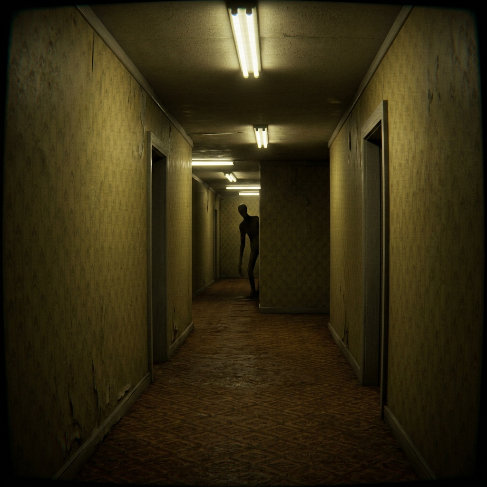

# LIMINAL



### **Made by João Afonso**

Jogo de terror psicológico na primeira pessoa, tipo Backrooms. Acordas num piso
de escritórios infinito — Level 0 — visto através de um sinal de TV antiga que
adoece à medida que o medo sobe. Encontra as 5 latas de snus para desbloquear a
única saída real. Não estás sozinho: os vultos observam-te ao longe, escondem-se
quando os encaras, e desaparecem se os fores procurar. A partir de certa altura,
correm atrás de ti.

**Sem HUD, sem mapa, sem lanterna.** O som é o teu radar.

## Jogar

### Windows (.exe)

Descarrega o `LIMINAL-windows.zip` da secção
[Releases](https://github.com/joaoafonso2004/LIMINAL/releases), extrai e abre o
`LIMINAL.exe`. Não precisa de instalação.

### Controlos

| Tecla | Ação |
|---|---|
| W A S D | Andar |
| Rato | Olhar |
| E | Apanhar snus |
| Esc | Pausa |

## Co-op (2–4 jogadores) — como configurar

O co-op usa um relay público na internet — **não é preciso configurar servidor,
abrir portas nem estar na mesma rede.** Basta que todos tenham o jogo e ligação
à internet.

### Passo a passo

1. **Quem cria a sala (host):**
   - Menu → **CO-OP**
   - Em **HOST**, escolhe o tamanho do grupo: **2**, **3** ou **4**
   - O jogo mostra um **código de sala** (ex.: `4590`) — envia-o aos teus amigos
2. **Quem entra (os amigos):**
   - Menu → **CO-OP**
   - Escrever o código no campo **CODE** → **JOIN**
3. **O jogo começa automaticamente quando a sala estiver cheia.**
   Escolhe bem o tamanho: uma sala de 3 só arranca com 3 jogadores.

### Regras do co-op

- O labirinto é **idêntico para todos** e os snus são partilhados — qualquer um
  pode apanhá-los, contam para a equipa toda.
- Se **um** jogador chegar à saída, **toda a equipa escapa**.
- Se a entidade te apanhar, ficas fora de combate a observar — os teus colegas
  continuam. Se caírem **todos**, a run termina e recomeça.
- Cada jogador tem os seus próprios sustos: os vultos que tu vês são só teus.

### Problemas comuns

- **"Could not join that room"** — código errado, sala já cheia ou sala expirada.
  Confirma o código com o host (novo código a cada sala).
- **"Could not reach the lobby server"** — sem internet ou o relay está em baixo.
  Tenta de novo dentro de momentos.
- Para desenvolvimento com relay local: define a variável de ambiente
  `LIMINAL_RELAY` (ex.: `ws://localhost:8000`) antes de abrir o jogo.

## Desenvolvimento

Projeto **Godot 4** (testado com 4.6.1, renderer Compatibility/WebGL2).

1. Instala o [Godot 4.6+](https://godotengine.org/download)
2. Abre o `project.godot`
3. Corre a cena principal (`F5`)

Os valores de pacing/dificuldade/atmosfera estão centralizados em
[`scripts/tuning.gd`](scripts/tuning.gd) e documentados em
[`docs/design/game-design.md`](docs/design/game-design.md).

## Créditos

- Sons da entidade: **juanjo_sound** — *Backrooms Entity SFX (Vol. 1)*

### Exportar o .exe

1. Editor → *Project → Export* (o preset **Windows Desktop** está incluído em
   `export_presets.cfg`; instala os export templates quando o editor pedir)
2. Ou por linha de comandos:
   ```
   godot --headless --path . --export-release "Windows Desktop" build/LIMINAL.exe
   ```
